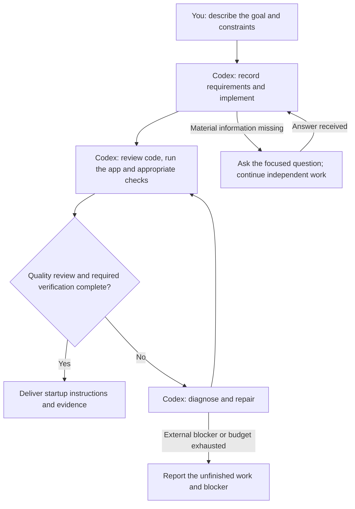

# exp

Turn ideas into runnable MVPs with Codex. Choose technology for each project's needs and verify the result with real tests.

## Get started

Open this folder in Codex and describe what you want:

```text
Use $exp-build to create a single-user, local task manager.
I need to add and complete tasks, and keep them after reopening the app.
Recommend suitable technology, implement it, and verify the result.
```

Each project lives in its own `YYYY-MM-DD-name/` folder, with requirements in `SPEC.md`. To explore first, say “Plan only; do not implement yet.”

## How it works

Describe the outcome and constraints in the Codex conversation. Codex implements the application, reviews the changed code using the shared quality principles in [AGENTS.md](AGENTS.md), and verifies the main user flow with actual operation and appropriate native checks. New projects also verify their documented setup and tests from a fresh source copy. Delivery includes startup instructions, observed results, and any remaining limitations. UI acceptance covers the affected states; motion work uses the conditional design guidance and requires visual and performance evidence before claiming verified smoothness. A passing automated report does not cover untested behavior.



If your requirements are already clear, you can request implementation and verification directly. Planning-only requests stop at the proposal.

## Available skills

| Skill | Purpose |
| --- | --- |
| `$exp-brainstorm` | Explore scope, architecture, and flows; use visuals when useful |
| `$exp-build` | Implement and verify an MVP |
| `$exp-design` | Shape interface design and review usability |
| `$exp-review` | Review code and acceptance evidence |
| `$exp-debug` | Diagnose and fix failures |
| `$exp-reset` | Move selected projects into recoverable backups |

## Project structure

```text
exp/
├── .agents/skills/           # Instructions for Codex
├── scaffold/                # Technology-neutral project template
├── harness/                 # Optional acceptance checks and bounded repair
├── tests/                   # Tests for the harness itself
└── YYYY-MM-DD-name/         # Independent MVP projects
```

`scaffold` provides the starting point and skills guide the work. Keep this repository layout: the skills use workbench resources and are not standalone installable packages.

Generated projects are local and excluded from Git. The historical Local Tasks pilot is not included in this repository; create your own project using the prompt above. Each project keeps its dependencies, data, and acceptance evidence inside its own directory.

## Optional harness

New projects use native tests and actual operation by default. Existing projects retain their established gates. When you explicitly request harness acceptance, Codex registers executable cases and uses `verify` to save a report tied to the current files. An existing harness contract remains required even if it is broken.

For requested bounded automatic repair, `run` calls a separate Codex CLI process after failed verification and rechecks the result. It repairs application code against fixed acceptance checks; normal feature development stays in the current conversation. The Stop hook is a separate, opt-in integration. See [the harness contract](harness/README.md) for setup and evidence limits.

## Further reading

- [Skill alignment and verification](docs/skill-alignment.md): scope, rationale, and checks for the current instruction update.
- [Prompt templates](PROMPTS.md): copy and fill in your requirements.
- [Verification and automatic repair](harness/README.md): commands, requirements, and limits.
- [Security](SECURITY.md): trust model, evidence files, and vulnerability reporting.

## License

[MIT](LICENSE).
